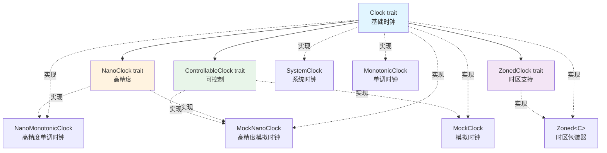
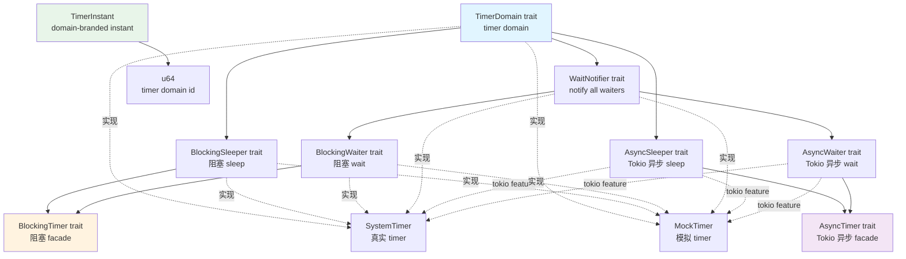

# Clock 时钟抽象设计文档

## 版本信息

- **文档版本**: 1.1
- **创建日期**: 2025-10-19
- **更新日期**: 2026-05-16
- **作者**: 胡海星

## 1. 设计概述

本文档描述了 `qubit-clock` crate 的架构设计。该设计提供了一套清晰、类型安全、灵活的时钟与计时器抽象，支持多种使用场景。

### 1.1 设计目标

1. **职责分离**：将时间获取、时区支持、高精度测量、时钟控制、deadline wait 等功能分离到不同的 trait
2. **类型安全**：通过类型系统在编译期保证功能支持（如是否支持时区、纳秒精度等）
3. **零成本抽象**：不需要的功能不付出任何性能代价
4. **易于测试**：提供可控制的模拟时钟，支持单元测试和集成测试
5. **灵活组合**：通过包装器模式灵活组合不同的功能
6. **Timer domain 隔离**：`TimerInstant` 只能在创建它的 timer domain 中比较和等待，避免不同 timer 的相对时间轴被误用

### 1.2 核心设计原则

- **接口隔离原则**：不强制实现不需要的功能
- **单一职责原则**：每个 trait 和类型只负责一个明确的功能
- **组合优于继承**：通过组合而非继承来扩展功能
- **依赖倒置原则**：依赖抽象（trait）而非具体实现

## 2. 架构设计

### 2.1 Trait 层次结构

```
Clock (基础时钟 trait)
├── NanoClock (高精度时钟 trait)
├── ZonedClock (带时区的时钟 trait)
└── ControllableClock (可控制的时钟 trait)

TimerDomain (timer-domain 单调时间域 trait)
├── BlockingSleeper / AsyncSleeper (只按 deadline 完成的 sleep trait)
├── WaitNotifier (waiter 通知 trait)
├── BlockingWaiter / AsyncWaiter (deadline 或 notification wait trait)
└── BlockingTimer / AsyncTimer (便捷组合 facade)
```

**说明**：
- `Clock` 是基础 trait，提供 UTC 时间
- `NanoClock`、`ZonedClock`、`ControllableClock` 都继承自 `Clock`
- 这三个扩展 trait 是**正交的**，互不依赖
- `TimerDomain` 系列不继承 `Clock`，因为它表达的是 timer domain 内的相对单调时间轴，不表达 UTC 当前时间
- 异步 timer trait 只在启用 `tokio` feature 时导出

### 2.2 实现类型

```
Clock trait 实现：
├── SystemClock (系统时钟)
├── MonotonicClock (单调时钟)
├── NanoMonotonicClock (高精度单调时钟)
├── MockClock (模拟时钟)
└── MockNanoClock (高精度模拟时钟)

包装器：
└── Zoned<C: Clock> (为任何 Clock 添加时区支持)

Timer trait 实现：
├── SystemTimer (真实单调计时器)
└── MockTimer (可手动控制的模拟计时器)
```

### 2.3 类型关系图


```mermaid
graph TD
    Clock[Clock trait<br/>基础时钟]
    NanoClock[NanoClock trait<br/>高精度]
    ZonedClock[ZonedClock trait<br/>时区支持]
    ControllableClock[ControllableClock trait<br/>可控制]

    SystemClock[SystemClock<br/>系统时钟]
    MonotonicClock[MonotonicClock<br/>单调时钟]
    NanoMonotonicClock[NanoMonotonicClock<br/>高精度单调时钟]
    MockClock[MockClock<br/>模拟时钟]
    MockNanoClock[MockNanoClock<br/>高精度模拟时钟]
    Zoned[Zoned&lt;C&gt;<br/>时区包装器]

    Clock --> NanoClock
    Clock --> ZonedClock
    Clock --> ControllableClock

    Clock -.实现.-> SystemClock
    Clock -.实现.-> MonotonicClock
    Clock -.实现.-> NanoMonotonicClock
    Clock -.实现.-> MockClock
    Clock -.实现.-> MockNanoClock
    Clock -.实现.-> Zoned

    NanoClock -.实现.-> NanoMonotonicClock
    NanoClock -.实现.-> MockNanoClock
    ZonedClock -.实现.-> Zoned
    ControllableClock -.实现.-> MockClock
    ControllableClock -.实现.-> MockNanoClock

    style Clock fill:#e1f5ff
    style NanoClock fill:#fff3e0
    style ZonedClock fill:#f3e5f5
    style ControllableClock fill:#e8f5e9
```

Timer 模块使用独立的类型关系，不把相对单调时间轴混入 UTC 时钟抽象：


```mermaid
graph TD
    TimerDomain[TimerDomain trait<br/>timer domain]
    BlockingSleeper[BlockingSleeper trait<br/>阻塞 sleep]
    BlockingWaiter[BlockingWaiter trait<br/>阻塞 wait]
    BlockingTimer[BlockingTimer trait<br/>阻塞 facade]
    AsyncSleeper[AsyncSleeper trait<br/>Tokio 异步 sleep]
    AsyncWaiter[AsyncWaiter trait<br/>Tokio 异步 wait]
    AsyncTimer[AsyncTimer trait<br/>Tokio 异步 facade]
    WaitNotifier[WaitNotifier trait<br/>notify all waiters]
    TimerInstant[TimerInstant<br/>domain-branded instant]
    DomainId[u64<br/>timer domain id]
    SystemTimer[SystemTimer<br/>真实 timer]
    MockTimer[MockTimer<br/>模拟 timer]

    TimerDomain --> BlockingSleeper
    TimerDomain --> WaitNotifier
    WaitNotifier --> BlockingWaiter
    BlockingSleeper --> BlockingTimer
    BlockingWaiter --> BlockingTimer
    TimerDomain --> AsyncSleeper
    WaitNotifier --> AsyncWaiter
    AsyncSleeper --> AsyncTimer
    AsyncWaiter --> AsyncTimer
    TimerInstant --> DomainId

    TimerDomain -.实现.-> SystemTimer
    BlockingSleeper -.实现.-> SystemTimer
    BlockingWaiter -.实现.-> SystemTimer
    WaitNotifier -.实现.-> SystemTimer
    AsyncSleeper -.tokio feature.-> SystemTimer
    AsyncWaiter -.tokio feature.-> SystemTimer

    TimerDomain -.实现.-> MockTimer
    BlockingSleeper -.实现.-> MockTimer
    BlockingWaiter -.实现.-> MockTimer
    WaitNotifier -.实现.-> MockTimer
    AsyncSleeper -.tokio feature.-> MockTimer
    AsyncWaiter -.tokio feature.-> MockTimer

    style TimerDomain fill:#e1f5ff
    style BlockingTimer fill:#fff3e0
    style AsyncTimer fill:#f3e5f5
    style TimerInstant fill:#e8f5e9
```

## 3. Trait 详细设计

### 3.1 Clock - 基础时钟 Trait

**职责**：提供 UTC 时间的基础接口

**定义**：
```rust
pub trait Clock: Send + Sync {
    /// 返回当前时间的毫秒时间戳（UTC）
    fn millis(&self) -> i64;

    /// 返回当前时间（UTC）
    fn time(&self) -> DateTime<Utc> {
        let millis = self.millis();
        DateTime::from_timestamp_millis(millis)
            .unwrap_or_else(|| clamp_out_of_range_millis(millis))
    }
}
```

**设计要点**：
- 所有方法返回 **UTC 时间**，不涉及时区
- `millis()` 是必须实现的方法，返回 Unix 时间戳（毫秒）
- `time()` 有默认实现，基于 `millis()` 构造 `DateTime<Utc>`
- 当毫秒时间戳超出 chrono 可表达范围时，`time()` 会 clamp 到最近边界，而不是回退到当前系统时间
- 要求 `Send + Sync`，确保线程安全

**适用场景**：
- 日志时间戳
- 性能监控
- 任何只需要 UTC 时间的场景

**文件位置**：`src/clock/clock.rs`

---

### 3.2 NanoClock - 高精度时钟 Trait

**职责**：提供纳秒级精度的时间测量

**定义**：
```rust
pub trait NanoClock: Clock {
    /// 返回当前时间的纳秒时间戳（UTC）
    fn nanos(&self) -> i128;

    /// 返回当前时间（UTC，纳秒精度）
    fn time_precise(&self) -> DateTime<Utc> {
        let nanos = self.nanos();
        let secs = nanos.div_euclid(1_000_000_000);
        let nsecs = nanos.rem_euclid(1_000_000_000) as u32;
        let secs = match i64::try_from(secs) {
            Ok(value) => value,
            Err(_) if nanos < 0 => return DateTime::<Utc>::MIN_UTC,
            Err(_) => return DateTime::<Utc>::MAX_UTC,
        };
        DateTime::from_timestamp(secs, nsecs).unwrap_or({
            if nanos < 0 {
                DateTime::<Utc>::MIN_UTC
            } else {
                DateTime::<Utc>::MAX_UTC
            }
        })
    }
}
```

**设计要点**：
- 继承自 `Clock`，是 Clock 的特化
- 使用 `i128` 存储纳秒时间戳，避免溢出
- 提供 `time_precise()` 方法，返回纳秒精度的 `DateTime`
- 使用欧几里得除法处理负数纳秒时间戳，超出 chrono 范围时 clamp 到最近边界
- **接口隔离**：不需要纳秒精度的实现不用提供此 trait

**适用场景**：
- 高精度性能测试
- 微基准测试（microbenchmark）
- 需要纳秒级精度的时间测量

**文件位置**：`src/clock/nano_clock.rs`

---

### 3.3 ZonedClock - 带时区的时钟 Trait

**职责**：提供时区支持，能够返回本地时间

**定义**：
```rust
pub trait ZonedClock: Clock {
    /// 返回此时钟的时区
    fn timezone(&self) -> Tz;

    /// 返回当前本地时间（使用此时钟的时区）
    fn local_time(&self) -> DateTime<Tz> {
        self.time().with_timezone(&self.timezone())
    }
}
```

**设计要点**：
- 继承自 `Clock`，是 Clock 的扩展
- `timezone()` 返回时钟关联的时区
- `local_time()` 返回本地时间，使用时钟自己的时区
- 默认实现通过 `time()` + `with_timezone()` 完成转换

**适用场景**：
- 用户界面显示
- 业务逻辑（订单创建时间、记录时间等）
- 任何需要显示本地时间的场景

**文件位置**：`src/clock/zoned_clock.rs`

---

### 3.4 ControllableClock - 可控制的时钟 Trait

**职责**：提供时钟控制功能，用于测试

**定义**：
```rust
pub trait ControllableClock: Clock {
    /// 设置时钟的当前时间
    fn set_time(&self, instant: DateTime<Utc>);

    /// 将时钟前进指定的时间
    fn add_duration(&self, duration: Duration);

    /// 重置时钟到初始状态
    fn reset(&self);
}
```

**设计要点**：
- 继承自 `Clock`，是 Clock 的扩展
- 提供三个控制方法：设置时间、增加时间、重置
- 主要用于测试场景，不应该在生产代码中使用

**适用场景**：
- 单元测试
- 集成测试
- 任何需要模拟时间的测试场景

**文件位置**：`src/clock/controllable_clock.rs`

---

### 3.5 Timer Trait - Timer Domain 计时器 Trait

**职责**：提供相对单调时间轴上的 deadline、wait 和 sleep 能力。

Timer API 位于 `src/timer` 模块下，不与 `Clock` 继承关系绑定。原因是
`Clock` 关注 UTC 当前时间，而 timer 关注“从某个 timer 创建时刻开始”的单调
elapsed time。不同 timer 拥有不同的 timer domain，它们的 `TimerInstant`
不能相互比较或混用。

**定义**：
```rust
pub trait TimerDomain: Send + Sync {
    fn id(&self) -> u64;
    fn now(&self) -> TimerInstant;
    fn deadline_after(&self, duration: Duration) -> TimerInstant;
    fn duration_until(&self, deadline: TimerInstant) -> Result<Option<Duration>, TimerError>;
}

pub trait BlockingSleeper: TimerDomain {
    fn sleep_until(&self, deadline: TimerInstant) -> Result<(), TimerError>;
    fn sleep_for(&self, duration: Duration) -> Result<(), TimerError>;
}

pub trait WaitNotifier: TimerDomain {
    fn notify_all_waiters(&self);
}

pub trait BlockingWaiter: WaitNotifier {
    fn wait_until(&self, deadline: TimerInstant) -> Result<TimerWaitOutcome, TimerError>;
    fn wait_for(&self, duration: Duration) -> Result<TimerWaitOutcome, TimerError>;
}

pub trait BlockingTimer: BlockingSleeper + BlockingWaiter {}
```

启用 `tokio` feature 后还会导出：

```rust
pub trait AsyncSleeper: TimerDomain {
    fn sleep_until_async<'a>(&'a self, deadline: TimerInstant) -> Pin<Box<dyn Future<Output = Result<(), TimerError>> + Send + 'a>>;
    fn sleep_for_async<'a>(&'a self, duration: Duration) -> Pin<Box<dyn Future<Output = Result<(), TimerError>> + Send + 'a>>;
}

pub trait AsyncWaiter: WaitNotifier {
    fn wait_until_async<'a>(&'a self, deadline: TimerInstant) -> Pin<Box<dyn Future<Output = Result<TimerWaitOutcome, TimerError>> + Send + 'a>>;
    fn wait_for_async<'a>(&'a self, duration: Duration) -> Pin<Box<dyn Future<Output = Result<TimerWaitOutcome, TimerError>> + Send + 'a>>;
}

pub trait AsyncTimer: AsyncSleeper + AsyncWaiter {}
```

**设计要点**：
- `TimerInstant` 内部携带 `domain_id: u64` 和相对于该 domain 零点的 elapsed time
- 所有接收外部 `TimerInstant` 的 API 都先校验 timer domain，不匹配时返回 `TimerError::TimerDomainMismatch`
- `Duration` 参数（如 `sleep_for(duration)`）表示“相对于当前 timer instant 的一段时长”
- `TimerWaitOutcome::Notified` 表示 wait 被显式通知提前唤醒，`sleep_*` 方法不把 notification 作为事件源或完成信号
- `AsyncTimer` 不引入 `async-trait` 依赖，而是返回 boxed `Future`，以保持依赖面可控

**适用场景**：
- 可测试的 timeout / retry / backoff 逻辑
- 不想在测试中等待真实时间的 deadline 控制
- 需要显式 notification 打断 wait 的后台任务

**文件位置**：`src/timer/*.rs`

## 4. 实现类型详细设计

### 4.1 SystemClock - 系统时钟

**职责**：提供基于系统时间的时钟实现

**定义**：
```rust
pub struct SystemClock;

impl Clock for SystemClock {
    fn millis(&self) -> i64 {
        Utc::now().timestamp_millis()
    }

    fn time(&self) -> DateTime<Utc> {
        Utc::now()
    }
}
```

**设计要点**：
- 零字段结构体（ZST），无运行时开销
- 直接调用系统 API 获取时间
- 受系统时间调整影响（NTP 同步、手动调整等）
- 只实现 `Clock` trait，不实现 `ZonedClock`

**使用示例**：
```rust
// 简单场景：只需要 UTC 时间
let clock = SystemClock::new();
let timestamp = clock.millis();

// 需要时区：使用 Zoned 包装
let clock = Zoned::new(SystemClock::new(), Shanghai);
let local = clock.local_time();
```

**线程安全性**：完全线程安全，无可变状态

**文件位置**：`src/clock/system_clock.rs`

---

### 4.2 MonotonicClock - 单调时钟

**职责**：提供单调递增的时钟，不受系统时间调整影响

**定义**：
```rust
pub struct MonotonicClock {
    instant_base: Instant,
    system_time_base_millis: i64,
}

impl Clock for MonotonicClock {
    fn millis(&self) -> i64 {
        self.system_time_base_millis
            .saturating_add(self.monotonic_millis())
    }
}
```

**设计要点**：
- 使用 `Instant` 作为时间源，保证单调性
- 在创建时记录基准点（`instant_base` 和 `system_time_base_millis`）
- 后续时间通过计算 `elapsed` 得出
- `millis()` 使用饱和加法，极端长运行或极端基准值下不会整数溢出
- 只实现 `Clock` trait，**不实现** `ZonedClock`

**为什么不实现 ZonedClock？**
- MonotonicClock 的主要用途是**测量时间间隔**，不是获取"当前时间"
- 时区对时间间隔测量没有意义
- 避免误导用户用它来获取本地时间

**适用场景**：
- 性能监控
- 超时控制
- 时间间隔测量
- 任何需要稳定、单调时间源的场景

**使用示例**：
```rust
let clock = MonotonicClock::new();
let start = clock.millis();

// 执行操作
do_something();

let elapsed = clock.millis() - start;
println!("耗时: {} ms", elapsed);
```

**线程安全性**：完全线程安全，所有字段不可变

**文件位置**：`src/clock/monotonic_clock.rs`

---

### 4.3 NanoMonotonicClock - 高精度单调时钟

**职责**：提供纳秒级精度的单调时钟

**定义**：
```rust
pub struct NanoMonotonicClock {
    instant_base: Instant,
    system_time_base_seconds: i64,
    system_time_base_nanos: u32,
}

impl Clock for NanoMonotonicClock { /* ... */ }
impl NanoClock for NanoMonotonicClock { /* ... */ }
```

**设计要点**：
- 同时实现 `Clock` 和 `NanoClock`
- 使用 `Instant` 保证单调性
- 分别存储秒和纳秒作为墙钟基准，后续叠加 `Instant` 流逝时间
- `nanos()` 使用 `i128` 和饱和加法，`millis()` 转换为 `i64` 时使用饱和转换
- 只实现 `Clock` 和 `NanoClock`，不实现 `ZonedClock`

**适用场景**：
- 高精度性能测试
- 微基准测试
- 需要纳秒级精度的时间测量

**使用示例**：
```rust
let clock = NanoMonotonicClock::new();
let start = clock.nanos();

// 执行操作
do_something();

let elapsed = clock.nanos() - start;
println!("耗时: {} ns", elapsed);
```

**线程安全性**：完全线程安全，所有字段不可变

**文件位置**：`src/clock/nano_monotonic_clock.rs`

---

### 4.4 MockClock - 模拟时钟

**职责**：提供可控制的时钟实现，用于测试

**定义**：
```rust
pub struct MockClock {
    inner: Arc<Mutex<MockClockInner>>,
}

struct MockClockInner {
    initial_time: i64,
    initial_progression: MockClockProgression,
    epoch: i64,
    monotonic_clock: MonotonicClock,
    monotonic_base_millis: i64,
    progression: MockClockProgression,
    millis_to_add: i64,
    millis_to_add_each_time: i64,
    add_every_time: bool,
}

impl Clock for MockClock { /* ... */ }
impl ControllableClock for MockClock { /* ... */ }
```

**设计要点**：
- 实现 `Clock` 和 `ControllableClock`
- 创建时捕获系统时间作为初始冻结读数
- 使用 `Arc<Mutex<>>` 保证线程安全和可共享
- 支持设置逻辑当前时间、增加时间、自动递增等功能
- 默认使用冻结模式，保证测试可重复
- 通过 `MockClockProgression` 可切换到基于内部 `MonotonicClock` 的自然推进模式
- 切换冻结/单调推进时会先把当前逻辑读数重新锚定，避免开关造成时间跳变
- `set_time()` 设置当前逻辑读数，并保留当前 progression 与自动递增设置；后续是否自然推进由当前 progression 模式决定
- `reset()` 会恢复到创建时捕获的读数和初始 progression，并清除附加偏移和自动递增

**核心功能**：
1. **设置时间**：`set_time(instant)` - 将当前逻辑时间重新锚定到指定时间点，并保留推进策略
2. **增加时间**：`add_duration(duration)` - 前进指定时间
3. **自动递增**：`add_millis(millis, true)` - 每次调用自动增加
4. **推进模式**：`set_progression(mode)` / `set_monotonic_progression_enabled(enabled)` - 在冻结和单调自然推进之间切换
5. **重置**：`reset()` - 恢复到创建时的读数和 progression，并清除附加偏移

**适用场景**：
- 单元测试
- 集成测试
- 需要精确控制时间的测试场景

**使用示例**：
```rust
#[test]
fn test_with_fixed_time() {
    let mock = MockClock::new();
    mock.set_time(DateTime::parse_from_rfc3339("2024-01-01T00:00:00Z").unwrap());

    let service = TimeService::new(Arc::new(mock));
    // 测试逻辑...
}
```

**线程安全性**：完全线程安全，使用 `Mutex` 保护内部状态

**文件位置**：`src/clock/mock_clock.rs`

---

### 4.5 MockNanoClock - 高精度模拟时钟

**职责**：提供纳秒精度、可控制、冻结语义的测试时钟

**定义**：
```rust
pub struct MockNanoClock {
    inner: Arc<Mutex<MockNanoClockInner>>,
}

struct MockNanoClockInner {
    initial_nanos: i128,
    initial_progression: MockClockProgression,
    epoch_nanos: i128,
    monotonic_clock: NanoMonotonicClock,
    monotonic_base_nanos: i128,
    progression: MockClockProgression,
    nanos_to_add: i128,
    nanos_to_add_each_time: i128,
    add_every_time: bool,
}

impl Clock for MockNanoClock { /* ... */ }
impl NanoClock for MockNanoClock { /* ... */ }
impl ControllableClock for MockNanoClock { /* ... */ }
```

**设计要点**：
- 同时实现 `Clock`、`NanoClock` 和 `ControllableClock`
- 创建时用 `Utc::now()` 捕获纳秒级初始冻结读数
- 使用 `i128` 表示 Unix 纳秒时间戳，避免常见区间内的溢出问题
- `Clock::millis()` 由纳秒读数转换而来，超出 `i64` 范围时饱和到边界
- 默认使用冻结模式，保证测试可重复
- 通过 `MockClockProgression` 可切换到基于内部 `NanoMonotonicClock` 的自然推进模式
- 切换冻结/单调推进时会先把当前逻辑读数重新锚定，避免开关造成时间跳变
- `set_time()` 设置当前逻辑读数，并保留当前 progression 与自动递增设置；后续是否自然推进由当前 progression 模式决定

**核心功能**：
1. **设置时间**：`set_time(instant)` - 将纳秒级当前逻辑时间重新锚定到指定时间点，并保留推进策略
2. **增加时间**：`add_duration(duration)` - 按 chrono duration 前进，尽量保留纳秒精度
3. **纳秒推进**：`advance_nanos(nanos)` / `add_nanos(nanos, false)` - 一次性推进纳秒数
4. **自动递增**：`set_auto_advance_nanos(nanos)` / `add_nanos(nanos, true)` - 每次读取后推进下一次读数
5. **推进模式**：`set_progression(mode)` / `set_monotonic_progression_enabled(enabled)` - 在冻结和单调自然推进之间切换
6. **重置**：`reset()` - 恢复到创建时的读数和 progression，并清除附加偏移

**适用场景**：
- `NanoClock` 相关逻辑的确定性测试
- `NanoTimeMeter` 的可控测试
- 需要保留纳秒级 DateTime 精度的测试场景

**文件位置**：`src/clock/mock_nano_clock.rs`

---

### 4.6 Zoned<C> - 时区包装器

**职责**：为任何 `Clock` 添加时区支持

**定义**：
```rust
pub struct Zoned<C: Clock> {
    clock: C,
    timezone: Tz,
}

impl<C: Clock> Clock for Zoned<C> { /* 委托给 clock */ }
impl<C: Clock> ZonedClock for Zoned<C> { /* ... */ }
impl<C: NanoClock> NanoClock for Zoned<C> { /* 委托给 clock */ }
impl<C: ControllableClock> ControllableClock for Zoned<C> { /* 委托给 clock */ }
impl<C: Clock> Deref for Zoned<C> { /* ... */ }
```

**设计要点**：
- 泛型包装器，可以包装任何实现了 `Clock` 的类型
- 实现 `Clock` trait（委托给内部 clock）
- 实现 `ZonedClock` trait（提供时区功能）
- 如果内部 clock 实现 `NanoClock`，则 `Zoned<C>` 同样实现 `NanoClock`
- 如果内部 clock 实现 `ControllableClock`，则 `Zoned<C>` 同样实现 `ControllableClock`
- **关键特性**：实现 `Deref`，可以直接访问内部 clock 的方法

**扩展 trait 透传的作用**：
```rust
let mock = MockClock::new();
let zoned = Zoned::new(mock, Shanghai);

// ✅ 现在可以作为 trait object 使用
let controllable: &dyn ControllableClock = &zoned;
controllable.set_time(some_time);

let nano = Zoned::new(NanoMonotonicClock::new(), Shanghai);
let precise: &dyn NanoClock = &nano;
let nanos = precise.nanos();
```

**Deref 的作用**：
```rust
let mock = MockClock::new();
let zoned = Zoned::new(mock, Shanghai);

// ✅ 通过 Deref，仍然可以直接调用 MockClock 的方法
zoned.set_time(some_time);      // ControllableClock 方法
zoned.add_duration(duration);   // ControllableClock 方法
zoned.local_time();             // ZonedClock 方法
```

**为什么使用 Deref？**
- 提供便利性，无需手动访问内部 clock
- trait object 场景由显式 trait 透传解决，Deref 只承担调用便利性
- 符合 Rust 的智能指针惯例

**同时提供显式访问方法**：
```rust
impl<C: Clock> Zoned<C> {
    pub fn inner(&self) -> &C {
        &self.clock
    }

    pub fn into_inner(self) -> C {
        self.clock
    }
}
```

**适用场景**：
- 为任何 Clock 动态添加时区支持
- 特别适合测试场景：`Zoned<MockClock>`

**使用示例**：
```rust
// 包装 SystemClock
let clock = Zoned::new(SystemClock::new(), Shanghai);
let local = clock.local_time();

// 包装 MockClock（测试场景）
let mock = MockClock::new();
let clock = Zoned::new(mock, Shanghai);
clock.set_time(some_time);  // 通过 Deref 调用
let local = clock.local_time();
```

**线程安全性**：取决于内部 Clock 的线程安全性

**文件位置**：`src/clock/zoned.rs`

---

### 4.7 SystemTimer - 真实单调计时器

**职责**：基于 `std::time::Instant` 提供真实单调 deadline、wait 和 sleep。

**定义**：
```rust
pub struct SystemTimer {
    domain_id: u64,
    origin: Instant,
    notification_epoch: ArcMonitor<u64>,
    async_notifier: Arc<Notify>, // tokio feature
}
```

**设计要点**：
- 创建时生成独立 `u64` domain ID，并把当前 `Instant` 作为 timer domain 零点
- `now()` 返回相对于 `origin` 的 `TimerInstant`
- clone 共享同一个 timer domain 和 notification 状态
- `sleep_until()` 使用 `std::thread::sleep()` 按真实剩余时间睡眠，不响应 notification
- `wait_until()` 使用 `ArcMonitor` 的 timed wait 等待真实剩余时间或 notification
- `notify_all_waiters()` 推进 notification epoch 并唤醒阻塞 wait；启用 `tokio` feature 时也唤醒异步 wait，不唤醒 sleep
- `sleep_until_async()` 使用 `tokio::time::sleep()`，不响应 notification
- `wait_until_async()` 使用 `tokio::time::sleep()` 与 `Notify`，只在 `tokio` feature 下编译

**适用场景**：
- 生产环境超时控制
- 后台线程或异步任务的可中断等待
- 与 `MockTimer` 共享同一套 timer trait 的实现代码

**线程安全性**：完全线程安全，阻塞 notification 状态由 `ArcMonitor` 保护；启用 `tokio` feature 时异步 notification 状态由 `Notify` 保护

**文件位置**：`src/timer/system_timer.rs`

---

### 4.8 MockTimer - 可控制模拟计时器

**职责**：提供测试可手动推进的单调 timer domain。

**定义**：
```rust
pub struct MockTimer {
    domain_id: u64,
    shared: Arc<MockTimerShared>,
    async_time_epoch_sender: watch::Sender<u64>,         // tokio feature
    async_notification_epoch_sender: watch::Sender<u64>, // tokio feature
}
```

**设计要点**：
- elapsed time 从 `Duration::ZERO` 开始，不依赖真实时间流逝
- `set_elapsed()` 直接设置当前 elapsed time，`advance()` 饱和推进 elapsed time，`reset()` 回到零点
- 修改 elapsed time 会推进 time epoch，并唤醒 sleepers 和 waiters 重新检查 deadline
- `notify_all_waiters()` 只推进 notification epoch，并只唤醒 waiters
- `sleep_until()` 只等待 time epoch 变化，直到 mock time 到达 deadline
- `wait_until()` 在 mock time 达到 deadline 时返回 `DeadlineReached`，在 notification epoch 改变且 deadline 未到时返回 `Notified`
- 异步路径使用两个 `tokio::sync::watch` channel 分别保存 time epoch 和 notification epoch，避免 subscribe 前后出现竞态时静默丢失事件
- 与 `SystemTimer` 一样，所有外部 deadline 都必须属于当前 timer domain

**适用场景**：
- timeout、retry、backoff 等时间相关逻辑的确定性测试
- 需要手动控制“时间已经过去多少”的测试
- 同时覆盖阻塞式和 Tokio 异步等待逻辑

**线程安全性**：完全线程安全，clone 共享状态，所有状态读写由 `Mutex` 保护

**文件位置**：`src/timer/mock_timer.rs`

## 5. 使用场景与示例

### 5.1 场景 1：简单日志（只需要 UTC 时间）

```rust
use qubit_clock::{Clock, SystemClock};

fn log_event(clock: &dyn Clock, event: &str) {
    let timestamp = clock.millis();
    println!("[{}] {}", timestamp, event);
}

fn main() {
    let clock = SystemClock::new();
    log_event(&clock, "Application started");
}
```

**说明**：
- 只需要 UTC 时间戳
- 使用 `SystemClock` 即可
- 不需要时区支持

---

### 5.2 场景 2：性能监控（需要单调性）

```rust
use qubit_clock::{Clock, MonotonicClock};
use std::sync::Arc;

struct PerformanceMonitor {
    clock: Arc<dyn Clock>,
}

impl PerformanceMonitor {
    pub fn measure<F>(&self, name: &str, f: F)
    where F: FnOnce()
    {
        let start = self.clock.millis();
        f();
        let elapsed = self.clock.millis() - start;
        println!("{}: {} ms", name, elapsed);
    }
}

fn main() {
    let monitor = PerformanceMonitor {
        clock: Arc::new(MonotonicClock::new()),
    };

    monitor.measure("task1", || {
        // 执行任务
    });
}
```

**说明**：
- 使用 `MonotonicClock` 保证时间单调性
- 不受系统时间调整影响
- 适合性能监控场景

---

### 5.3 场景 3：业务逻辑（需要本地时间）

```rust
use qubit_clock::{Clock, ZonedClock, SystemClock, Zoned};
use chrono_tz::Asia::Shanghai;
use std::sync::Arc;

struct Order {
    id: String,
    created_at: DateTime<Tz>,
}

struct OrderService {
    clock: Arc<dyn ZonedClock>,
}

impl OrderService {
    pub fn create_order(&self, id: String) -> Order {
        Order {
            id,
            created_at: self.clock.local_time(),
        }
    }
}

fn main() {
    let service = OrderService {
        clock: Arc::new(Zoned::new(SystemClock::new(), Shanghai)),
    };

    let order = service.create_order("ORDER-001".to_string());
    println!("订单创建时间（上海）: {}", order.created_at);
}
```

**说明**：
- 使用 `Zoned<SystemClock>` 获取本地时间
- 订单时间显示为上海时区
- 适合业务逻辑场景

---

### 5.4 场景 4：单元测试（需要控制时间）

```rust
use qubit_clock::{Clock, ZonedClock, ControllableClock, MockClock, Zoned};
use chrono_tz::Asia::Shanghai;
use std::sync::Arc;

#[test]
fn test_order_creation() {
    // 创建模拟时钟
    let mock = MockClock::new();
    let clock = Zoned::new(mock, Shanghai);

    // 设置固定时间（UTC 2024-01-01 00:00:00）
    clock.set_time(
        DateTime::parse_from_rfc3339("2024-01-01T00:00:00Z")
            .unwrap()
            .with_timezone(&Utc)
    );

    // 创建服务
    let service = OrderService {
        clock: Arc::new(clock),
    };

    // 创建订单
    let order = service.create_order("TEST-001".to_string());

    // 验证时间是上海时间 2024-01-01 08:00:00
    assert_eq!(order.created_at.hour(), 8);
    assert_eq!(order.created_at.day(), 1);
}
```

**说明**：
- 使用 `Zoned<MockClock>` 进行测试
- 通过 `Deref`，可以直接调用 `set_time()` 方法
- 可以精确控制测试时间

---

### 5.5 场景 5：高精度性能测试

```rust
use qubit_clock::{NanoClock, NanoMonotonicClock};

fn benchmark(clock: &dyn NanoClock) {
    let start = clock.nanos();

    // 执行操作
    for _ in 0..1000 {
        // 一些快速操作
    }

    let elapsed = clock.nanos() - start;
    println!("耗时: {} ns", elapsed);
    println!("平均: {} ns/op", elapsed / 1000);
}

fn main() {
    let clock = NanoMonotonicClock::new();
    benchmark(&clock);
}
```

**说明**：
- 使用 `NanoMonotonicClock` 获取纳秒精度
- 适合微基准测试
- 可以测量非常短的时间间隔

---

### 5.6 场景 6：可测试超时控制

```rust
use qubit_clock::timer::{BlockingTimer, MockTimer, TimerDomain};
use std::time::Duration;

fn wait_until_ready<T>(timer: &T) -> bool
where
    T: BlockingTimer,
{
    let deadline = timer.deadline_after(Duration::from_secs(5));
    while timer.duration_until(deadline).expect("deadline belongs to this timer").is_some() {
        if is_ready() {
            return true;
        }
        timer.wait_for(Duration::from_millis(10)).expect("self-created deadline should be valid");
    }
    false
}

#[test]
fn test_timeout_without_real_sleep() {
    let timer = MockTimer::new();
    let deadline = timer.deadline_after(Duration::from_secs(5));

    timer.advance(Duration::from_secs(5));

    assert_eq!(None, timer.duration_until(deadline).expect("deadline belongs to this timer"));
}
```

**说明**：
- `Duration` 参数表示相对于当前 timer instant 的一段时长
- `TimerInstant` 只能回传给创建它的 timer domain
- 测试中使用 `MockTimer::advance()` 可以瞬间推进 timeout，不需要真实等待

## 6. 文件组织结构

```
rs-clock/
├── src/
│   ├── lib.rs                    # 模块导出和文档
│   ├── clock/                    # Clock trait 和实现
│   ├── meter/                    # TimeMeter / NanoTimeMeter
│   └── timer/                    # Timer domain / SystemTimer / MockTimer
├── tests/
│   ├── clock/                    # Clock trait 和实现测试
│   ├── clock_tests.rs            # Clock 测试入口
│   ├── meter/                    # 时间计量器测试
│   ├── meter_tests.rs            # Meter 测试入口
│   ├── timer/                    # Timer 模块测试
│   ├── timer_tests.rs            # Timer 测试入口
│   └── readme_api_tests.rs       # README API 回归测试
├── doc/
│   └── clock_design.zh_CN.md     # 本设计文档
├── Cargo.toml
└── README.md
```

**组织原则**：
1. 每个 trait 单独一个文件
2. 每个实现类型单独一个文件
3. `src/clock/xxx.rs` 对应 `tests/clock/xxx_tests.rs`
4. `src/timer/xxx.rs` 对应 `tests/timer/xxx_tests.rs`
5. 测试代码与源代码分离
6. 所有组件在同一个 crate 中

## 7. 设计优势

### 7.1 职责分离清晰

- **Clock**：只提供 UTC 时间
- **ZonedClock**：只添加时区支持
- **NanoClock**：只添加纳秒精度
- **ControllableClock**：只添加控制功能
- **TimerDomain**：只表达 timer domain 内的单调 instant
- **BlockingSleeper / AsyncSleeper**：只表达 deadline sleep
- **BlockingWaiter / AsyncWaiter**：只表达 deadline-or-notification wait
- **WaitNotifier**：只表达 waiter notification
- **BlockingTimer / AsyncTimer**：只作为常用组合 facade

每个 trait 职责单一，互不干扰。

### 7.2 类型安全

```rust
// 编译期就知道是否支持时区
fn need_zoned(clock: &dyn ZonedClock) {
    let local = clock.local_time();  // ✅ 编译通过
}

fn need_zoned_wrong(clock: &dyn Clock) {
    // let local = clock.local_time();  // ❌ 编译错误：Clock 没有 local_time
}
```

### 7.3 零成本抽象

```rust
// 不需要时区？不引入时区包装
let clock = MonotonicClock::new();  // 小对象，只保存基准时间

// 需要时区？只在需要时添加
let clock = Zoned::new(MonotonicClock::new(), Shanghai);  // 包装 clock 并增加一个 Tz 字段
```

### 7.4 灵活组合

```rust
// 可以为任何 Clock 添加时区
let zoned_system = Zoned::new(SystemClock::new(), Shanghai);
let zoned_mock = Zoned::new(MockClock::new(), Shanghai);
let zoned_monotonic = Zoned::new(MonotonicClock::new(), Shanghai);
```

### 7.5 测试友好

```rust
// Zoned<MockClock> 通过 Deref 同时支持：
// - Clock 接口
// - ZonedClock 接口
// - ControllableClock 接口

let mock = MockClock::new();
let clock = Zoned::new(mock, Shanghai);

clock.set_time(time);       // ControllableClock
clock.local_time();         // ZonedClock
clock.millis();             // Clock
```

`MockTimer` 则让 deadline 相关测试不依赖真实时间：

```rust
let timer = MockTimer::new();
let deadline = timer.deadline_after(Duration::from_secs(5));

timer.advance(Duration::from_secs(5));
assert_eq!(None, timer.duration_until(deadline).expect("deadline belongs to this timer"));
```

## 8. 设计权衡

### 8.1 类型数量 vs 灵活性

**权衡**：设计引入了多个 trait 和类型，增加了学习成本

**收益**：
- 类型安全
- 职责清晰
- 灵活组合
- 零成本抽象

**结论**：收益大于成本，类型数量是必要的复杂度

### 8.2 Deref 与 trait 透传的语义

**争议**：Deref 通常用于智能指针，仅靠 Deref 做能力转发会导致 trait object 场景不完整

**解决方案**：
1. `Zoned<C>` 显式透传 `NanoClock` 和 `ControllableClock`
2. Deref 只作为调用便利性保留，不作为能力边界的唯一表达方式
3. 同时提供 `inner()` 和 `into_inner()` 方法供显式访问
4. 在文档中明确说明 Deref 的用途

### 8.3 MonotonicClock 与 ZonedClock

**设计决策**：MonotonicClock 不实现 ZonedClock

**理由**：
- MonotonicClock 用于测量时间间隔，不是获取"当前时间"
- 时区对时间间隔测量没有意义
- 避免误导用户

**如果用户非要添加时区？**
- 技术上可以：`Zoned::new(MonotonicClock::new(), tz)`
- 但语义上不推荐，应在文档中说明

## 9. 未来扩展

### 9.1 可能的扩展方向

1. **OffsetClock**：支持固定偏移量的时钟
2. **TickClock**：按固定间隔跳动的时钟
3. **SystemClockWithOffset**：系统时钟 + 偏移量

### 9.2 兼容性考虑

- 保持向后兼容
- 新功能通过新 trait 添加
- 不破坏现有 API

## 10. 参考资料

### 10.1 设计参考

- Java `java.time.Clock` 类设计
- Rust `std::time::Instant` 和 `SystemTime`
- Chrono crate 的时间处理

### 10.2 相关标准

- Unix 时间戳标准
- ISO 8601 时间格式
- IANA 时区数据库

## 11. 总结

本设计提供了一套清晰、类型安全、灵活的时钟抽象：

1. **职责分离**：通过多个正交的 trait 分离不同功能
2. **类型安全**：编译期保证功能支持
3. **零成本抽象**：不需要的功能不付出代价
4. **灵活组合**：通过 `Zoned<C>` 包装器灵活组合功能
5. **测试友好**：`MockClock` / `MockNanoClock` + `Zoned` 支持确定性测试

这个设计在简洁性、灵活性、类型安全之间取得了良好的平衡，适合各种使用场景。
